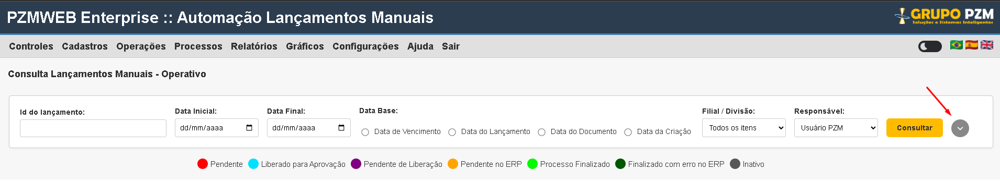
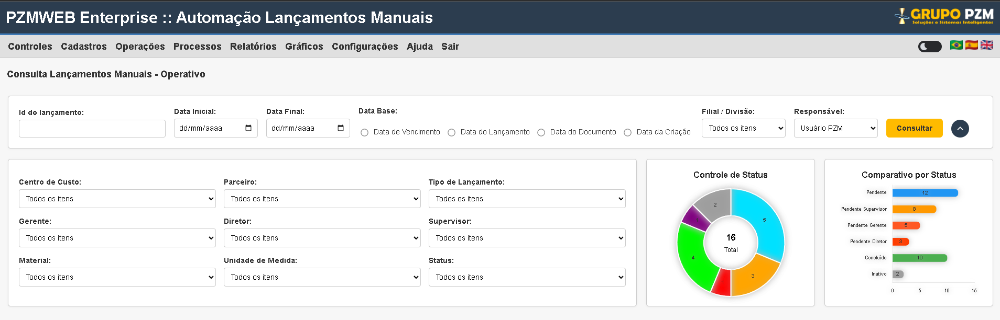
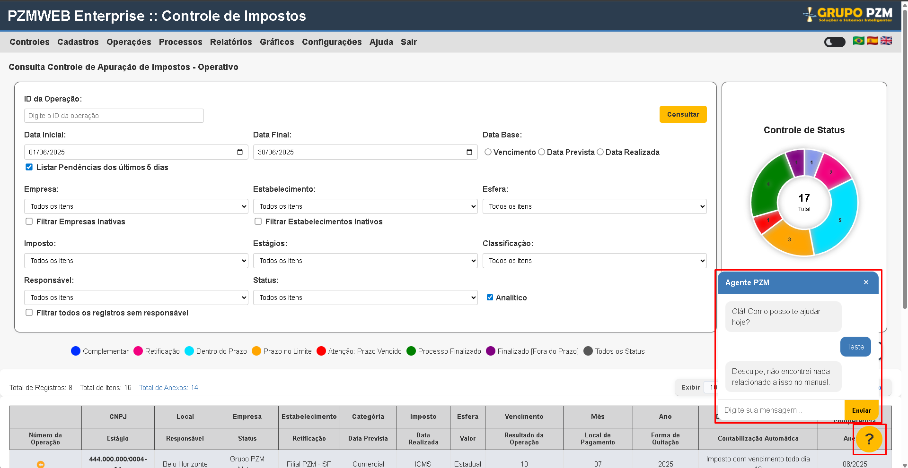
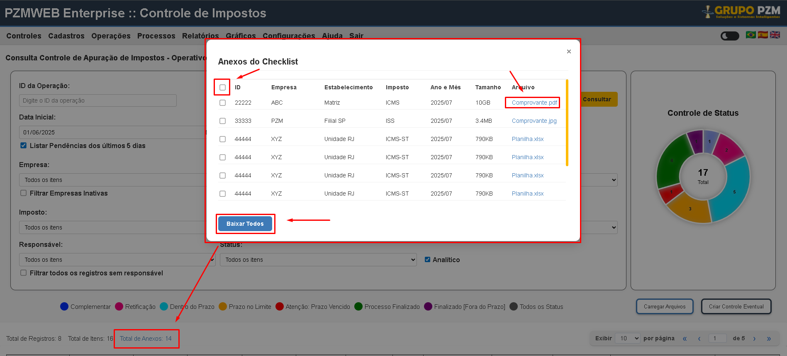

## Lançamentos Manuais

## 1. Seta indicativa de novos filtros

O campo deve permitir que o usuário possa consultar as informações do checklist atráves de novos filtros, ao clicar na seta, devem ser demonstrados novos filtros e dois gráficos que o usuário poderá utiliza-los como filtros como já mencionado acima.

## 2. Gráficos Incluídos

Nas telas de consultas de checklist agora há novos elementos. Sendo eles, gráficos que demonstraram as informações de atividades conforme tela em que o usuário estiver.

- **Tela do operativo**: O usuário visualizará as informações de cada status das atividades consultadas pelo usuário e também as atividades por status de aprovadores assim como seus valores. Na tela de lançamentos manuais, a informação mostrada se refere ao status para cada nivel de associação (gerente, supervisor, diretor). (Ao passar o mouse sobre o gráfico, deve ser indicado o status (nome) e a quantidade de registros de acordo com o que o gráfico traz).

- **Tela do supervisor**: O usuário visualizará as informações de cada status das atividades consultadas pelo usuário e também as atividades por status de aprovadores assim como seus valores. Na tela de lançamentos manuais, a informação mostrada se refere ao status para cada nivel de associação (gerente, supervisor, diretor). (Ao passar o mouse sobre o gráfico, deve ser indicado o status (nome) e a quantidade de registros de acordo com o que o gráfico traz).

**Observação:**

Os gráficos também devem servir como filtros, ou seja, ao clicarmos em algum campo do gráfico, como o de **pendente, **o sistema deve trazer as informações no checklist conforme filtrado, assim como ocorre nas legendas (farois de consulta).

## 3. Chatbot

Presentes em todas as telas, o farol que acompanha o usuário, sendo ele uma "?", permite com que o usuário abra uma especie de chat, onde poderá questionar o chat sobre dúvidas rápidas, como carregar um balancete, criar uma conta ou como processar um checklist. O farol acompanhará o usuário não importa onde ele esteja nas telas do sistema, exceto modais de atividades, anexos, etc.

## 4. Totalizadores de Anexos

O campo de totalizador de anexos exibe informações resumidas sobre os anexos inseridos no checklist consultado atráves do campo: "Total de Anexos". Ao clicar o usuário será levado a um modal onde poderá baixar os anexos desejados.

### Como ocorrerá:

O sistema irá demonstrar todos anexos inseridos nas atividades atráves desse campo, nele, tendo a possibilidade de download de todos os anexos de uma só vez, indicados cada um com o nome da atividade, ID e etc, referenciando de onde o anexo está sendo baixado e, além disso, o usuário poderá baixar apenas um clicando no link do anexo.

