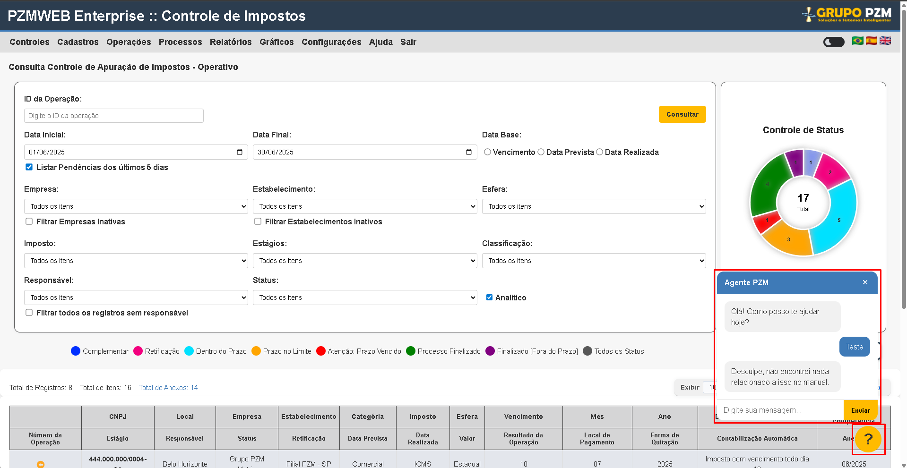

# Análise do Repositório PZM

Este documento detalha os comportamentos esperados do sistema PZM com base na análise do código-fonte disponível no repositório GitHub.

## 1. Botões de Consulta

### Funcionamento e Parâmetros:

O formulário de consulta contém os seguintes campos:

- **ID da Operação:** Um campo de texto (`<input type="text" placeholder="Digite o ID da operação" />`) para buscar por um ID específico.

- **Data Inicial e Data Final:** Campos de data (`<input type="date" />`) para definir um período de busca.

- **Listar Pendências dos últimos 5 dias:** Um checkbox (`<input type="checkbox" checked />`) que, quando marcado, filtra os resultados para mostrar apenas pendências dos últimos 5 dias, sobrescrevendo ou complementando o filtro de data.

- **Data Base:** Um grupo de radio buttons para selecionar a base da data de consulta: `Vencimento`, `Data Prevista` ou `Data Realizada` e consultar a partir deles.

- **Empresa:** Um dropdown (`<select>`) com a opção padrão "Todos os itens" e conforme ter cadastrado no ambiente. Contendo um checkbox "Filtrar Empresas Inativas" para refinar a busca.

- **Estabelecimento:** Similar ao campo Empresa, um dropdown (`<select>`) com a opção padrão "Todos os itens" e conforme ter cadastrado no ambiente, e um checkbox "Filtrar Estabelecimentos Inativos".

- **Esfera:** Um dropdown (`<select>`) com a opção padrão "Todos os itens" onde é possivel filtrar mais itens relacionados a esferas.

- **Imposto:** Um dropdown (`<select>`) com a opção padrão "Todos os itens"onde é possivel filtrar mais itens relacionados a impostos.

- **Estágios:** Um dropdown (`<select>`) com a opção padrão "Todos os itens" onde é possivel filtrar mais itens relacionados a estágios.

- **Classificação:** Um dropdown (`<select>`) com a opção padrão "Todos os itens" onde é possivel filtrar mais itens relacionados a classificação.

- **Responsável:** Um dropdown (`<select>`) com a opção padrão "Todos os itens" (tela de supervisor) e com o usuário logado (tela do operativo). Há um checkbox "Filtrar todos os registros sem responsável" para trazer apenas registros sem responsável atribuído.

- **Status:** Um dropdown (`<select>`) com a opção padrão "Todos os itens" com a possibilidade de filtragem dos demais status (pendente, concluído, etc).

- **Analítico:** Um checkbox (`<input type="checkbox" checked />`) que, quando marcado, exibe os resultados de forma detalhada.

### Botão "Consultar":

O botão `<button class="consulta">Consultar</button>` é o gatilho para iniciar a busca. A funcionalidade espera-se que, ao clicar neste botão, uma requisição seja enviada, com os parâmetros selecionados nos filtros. O sistema então retornaria os dados correspondentes na tabela abaixo dos filtros (`
`).

## 2. Botões de Associação de Responsável

O campo tem como funcionalidade a associação de responsável nos impostos flegados no checklist do sistema, assim como ocorre atualmente. Selecionamos o usuário que desejamos e clicamos em "Associar".

### Fluxo de Associação:

O fluxo de associação deve seguir da seguinte forma:

1. **Seleção de Registros:** O usuário seleciona um ou mais registros na tabela de resultados (`imp-info`) através dos checkboxes (`<input type="checkbox" name="checkbox" id="checkbox" />`) presentes em cada linha.

1. **Ação de Associação:** Após a seleção, o usuário que estiver realizando a ação, indica o responsável desejado no campo "Associar Responsável" e em seguida, clique em "Associar".

### Validações Aplicadas:

As validações para a associação de responsável podem incluir:

- **Permissões de Usuário:** Apenas usuários com as permissões adequadas podem associar ou alterar responsáveis.

- **Responsável Válido:** O responsável selecionado deve ser um usuário ativo no sistema.

## 3. Gráficos Incluídos

Nas telas de consultas de checklist (Impostos, Obrigações e Lançamentos) agora há novos elementos. Sendo eles, gráficos que demonstraram as informações de atividades conforme tela em que o usuário estiver.

- **Tela do operativo: **O usuário visualizará as informações de cada status das atividades no qual ele é responsável. (Ao passar o mouse sobre o gráfico, deve ser indicado o status (nome) e a quantidade de registros de acordo com o que o gráfico traz).

- **Tela do supervis**or**: **O usuário visualizará as informações de cada status das atividades consultadas pelo usuário e também as atividades por esfera no caso das telas de Impostos/Obrigações. Na tela de lançamentos manuais, a informação mostrada se refere ao status para cada nivel de associação (gerente, supervisor, diretor). (Ao passar o mouse sobre o gráfico, deve ser indicado o status (nome) e a quantidade de registros de acordo com o que o gráfico traz).

**Observação: **

Os gráficos também devem servir como filtros, ou seja, ao clicarmos em algum campo do gráfico, como o de **pendente, **o sistema deve trazer as informações no checklist conforme filtrado, assim como ocorre nas legendas (farois de consulta).

## 4. Totalizadores de Anexos

O campo de totalizador de anexos exibe informações resumidas sobre os anexos inseridos no checklist consultado atráves do campo: "Total de Anexos". Ao clicar o usuário será levado a um modal onde poderá baixar os anexos desejados.

### Como ocorrerá:

O sistema irá demonstrar todos anexos inseridos nas atividades atráves desse campo, nele, tendo a possibilidade de download de todos os anexos de uma só vez, indicados cada um com o nome da atividade, ID e etc, referenciando de onde o anexo está sendo baixado e, além disso, o usuário poderá baixar apenas um clicando no link do anexo.

## 5. Chatbot

Presentes em todas as telas, o farol que acompanha o usuário, sendo ele uma "?", permite com que o usuário abra uma especie de chat, onde poderá questionar o chat sobre dúvidas rápidas, como carregar um balancete, criar uma conta ou como processar um checklist. O farol acompanhará o usuário não importa onde ele esteja nas telas do sistema, exceto modais de atividades, anexos, etc.

## 6. Alternancia entre modo escuro e modo claro

O campo ao lado das bandeiras do sistema permitirá com que o usuário inverta as colorações do sistema entre modo claro e modo escuro, assim como ocorre em diversos sites e aplicativos. O campo permitirá que as cores sejam alteradas entre banco (padrão do sistema) e um tom mais escuro, mantendo a coloração original dos campos do sistema, alterando apenas alguns campos para harmonização visual.
