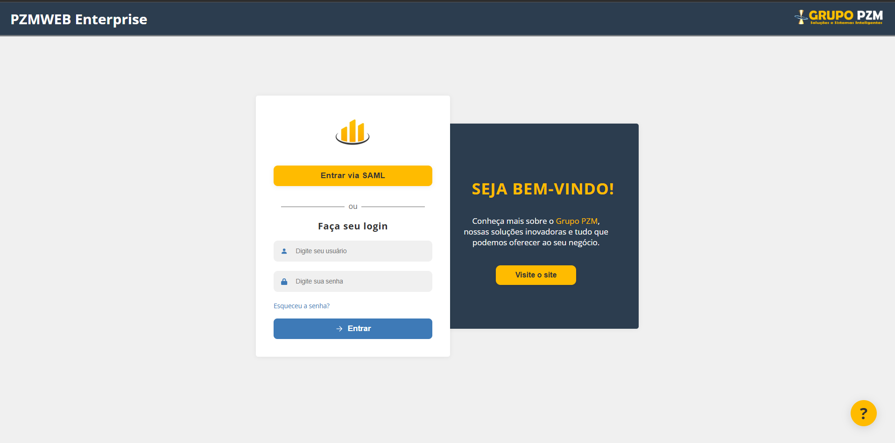
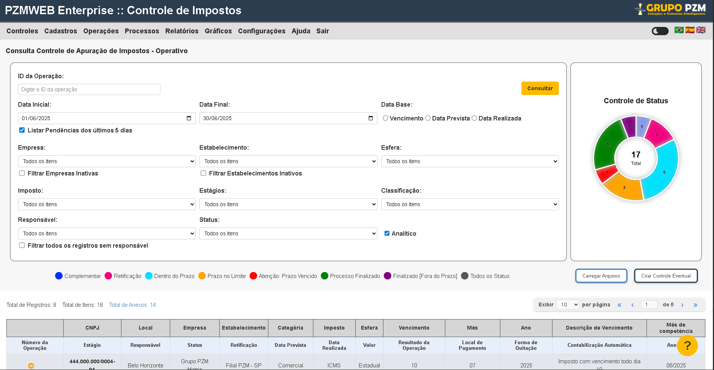
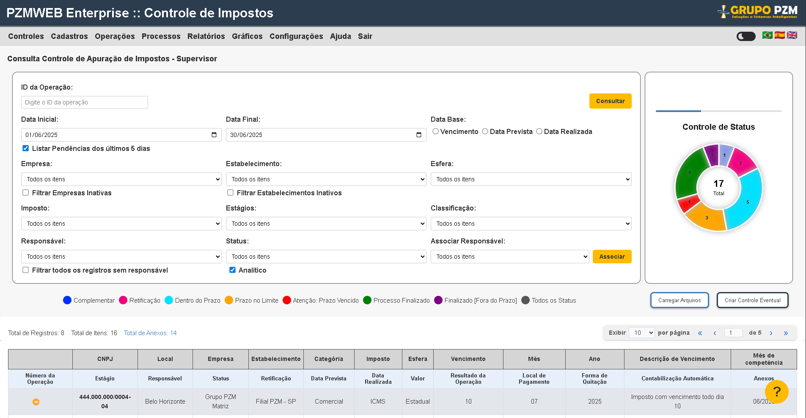
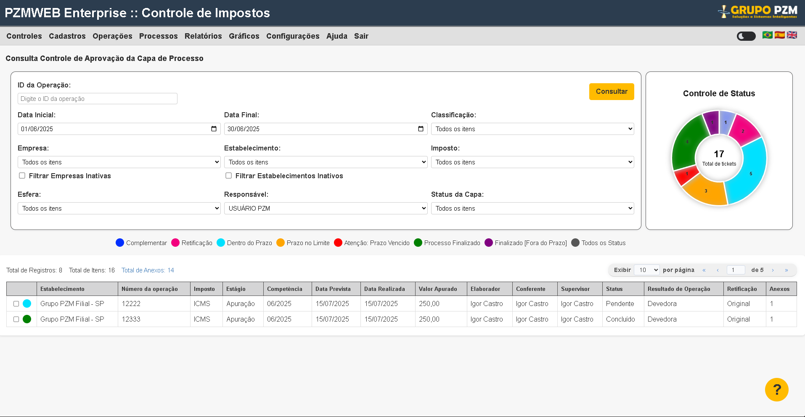
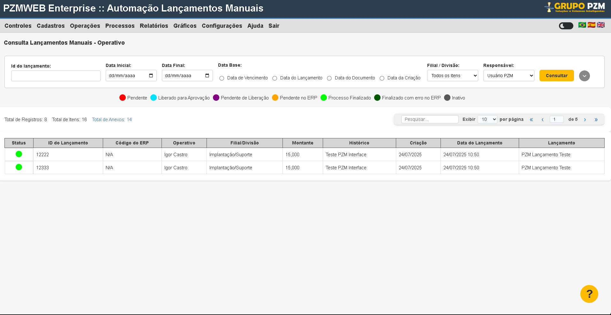
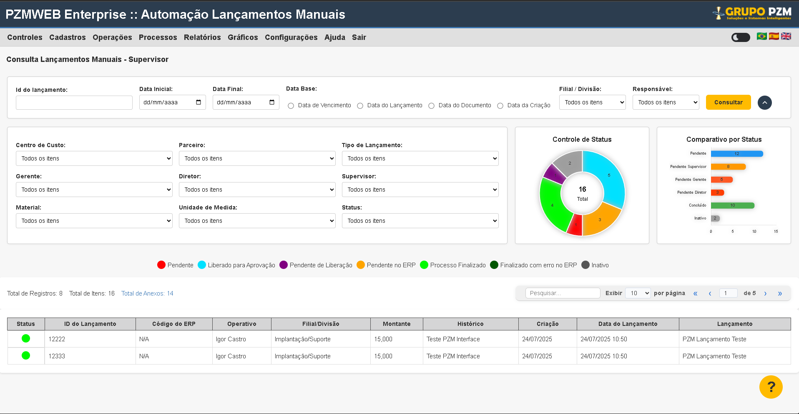
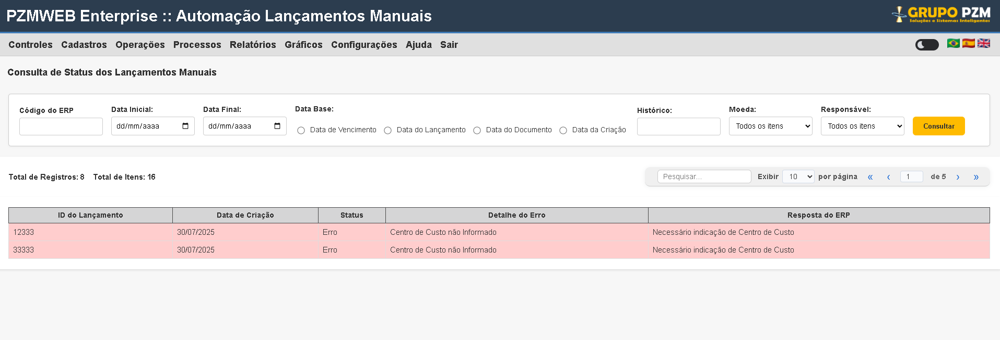

# Documentação Técnica - Padrão Visual Projeto PZM

Este documento define o padrão visual a ser seguido no desenvolvimento do projeto PZM, garantindo consistência e coesão em toda a aplicação.

## 1. Paleta de Cores

A paleta de cores do projeto PZM é definida no arquivo `colors.css` e deve ser utilizada conforme as diretrizes abaixo:

```css
:root {
  --primary-color: #2c3d4f;
  --secondary-color: #3e7ab7;
  --accent-color: #ffbb00;
  --background-color: #f7f7f7;
  --text-color: #333333;
  --muted-color: #e0e0e0;
  --border-color: #cccccc;
  --light-color: #ffffff;
  --dark-text-color: #343434;
  --shadow: 0 1px 10px rgba(0, 0, 0, 0.06);
  --link-color: #002fff;
  --danger-color: #f3007e;
  --dark-gray: #575757;
  --gray-50: #f9fafc;
  --gray-100: #f0f0f0;
  --gray-200: #e5e8f1;
  --gray-300: #d2dbe8;
  --gray-400: #ddd;
  --gray-500: #bbb;
  --gray-600: #888;
  --gray-700: #666;
  --gray-800: #555;
  --gray-850: #444;
  --gray-900: #252525;
  --gray-950: #232323;
  --overlay-color: #7c7c7e52;
  --warning-color: #c59101;
  --warning-bg: #ffeebd;
  --info-bg: #e3e6ec;
  --info-alt-bg: #e6effa;
  --link-light: #347ad8;
  --link-dark: #235cb1;
  --gray-b0: #b0b0b0;
  --gray-border-dark: #767a7e;
  --gray-777: #777777;
  --gray-4848: #484848;
  --gray-dfe: #dfe0e0;
  --gray-c9: #c9c9c9;
  --gray-da: #dadada;
  --gray-f1: #f1f1f1;
  --blue-soft: #88b7ff;
  --dark-surface: #2a2a2a;
  --dark-hover: #2b2b2b;
  --dark-border: #3a3a3a;
  --dark-muted: #3d3d3d;
  --dark-3b: #3b3b3b;
  --dark-2c: #2c2c2c;
  --dark-3030: #303030;
  --dark-4141: #414141;
  --dark-accent: #242c35;
  --dark-alt: #202020;
  --dark-bg: #1f1f1f;
  --dark-1e: #1e1e1e;
  --dark-151f2b: #151f2b;
  --dark-overlay: #0a0a0a;
  --overlay-dark: #0a0a0a0e;
  --toggle-light: #d8dbe0;
  --toggle-dark: #28292c;
  --status-dentro-prazo: rgb(0, 225, 255);
  --status-no-limite: orange;
  --status-vencido: red;
  --status-finalizado: green;
  --status-fora-prazo: purple;
  --status-success: rgb(0, 250, 0);
  --status-success-dark: rgb(0, 87, 0);
  --toggle-link: rgb(27, 129, 112);
  --toggle-link-hover: rgb(24, 94, 82);
  --highlight-light-red: rgb(255, 205, 205);
  --light-overlay: rgba(253, 253, 253, 0.39);
  --shadow-xs: rgba(0, 0, 0, 0.05);
  --shadow-sm: rgba(0, 0, 0, 0.1);
  --shadow-md: rgba(0, 0, 0, 0.15);
  --shadow-md2: rgba(0, 0, 0, 0.2);
  --shadow-lg: rgba(0, 0, 0, 0.3);
  --shadow-overlay-heavy: rgba(0, 0, 0, 0.45);
  --shadow-267: rgba(0, 0, 0, 0.267);
  --shadow-warning: rgba(255, 193, 7, 0.3);
  --shadow-blue-light: rgba(70, 90, 110, 0.07);
  --shadow-blue-dark: rgba(30, 40, 60, 0.07);
  --shadow-blue-09: rgba(70, 90, 110, 0.09);
  --shadow-white: rgba(255, 255, 255, 0.25);
  --shadow-link: rgba(44, 61, 79, 0.24);
  --shadow-light-alt: rgba(0, 0, 0, 0.08);
  --shadow-light-13: rgba(0, 0, 0, 0.13);
  --shadow-base: rgba(0, 0, 0, 0.06);
}
```

**Uso das Cores:**

- `--primary-color` (`#2c3d4f`): Cor principal da marca. Utilizada para cabeçalhos (Ex: `header` em `login.css`, `erp.css`, `capa-de-processo.css`), fundos de painéis principais (Ex: `welcome-panel` em `login.css`) e elementos de destaque (Ex: `lista-modulos a` em `modulos/style.css`).
- `--secondary-color` (`#3e7ab7`): Cor secundária, complementar à primária. Pode ser usada para sub-cabeçalhos (Ex: `input-group svg` em `login.css`), ícones e elementos interativos secundários (Ex: `btn-login` em `login.css`, `btn-download-todos` em `capa-de-processo.css`).
- `--accent-color` (`#ffbb00`): Cor de destaque. Ideal para botões de ação primários (Ex: `btn-whatsapp`, `btn-zendesk`, `btn-saml`, `btn-know` em `login.css`, `consulta` em `erp.css`), indicadores de foco (Ex: `titulo-principal::after` em `modulos/style.css`) e elementos que exigem atenção imediata.
- `--background-color` (`#f7f7f7`): Cor de fundo padrão para a maioria das páginas e seções (Ex: `body` em `erp.css`, `capa-de-processo.css`).
- `--text-color` (`#333333`): Cor padrão para textos gerais, garantindo boa legibilidade (Ex: `body` em `erp.css`, `chat-body` em `login.css`).
- `--muted-color` (`#e0e0e0`): Cor para elementos desabilitados, divisores ou textos de menor importância (Ex: `nav` em `erp.css`, `lista-modulos li` em `modulos/style.css`).
- `--border-color` (`#cccccc`): Cor padrão para bordas de inputs (Ex: `filtro-item input` em `erp.css`), cards e outros componentes (Ex: `container-modulos` em `modulos/style.css`).
- `--light-color` (`#ffffff`): Branco puro. Utilizado para fundos de cards (Ex: `login-form` em `login.css`), texto em fundos escuros (Ex: `header` em `login.css`) e elementos que precisam de alto contraste.
- `--dark-text-color` (`#343434`): Uma variação de texto escuro, para maior contraste em certas áreas (Ex: `sair` em `login.css`, `titulo-principal` em `modulos/style.css`).
- `--link-color` (`#002fff`): Cor padrão para links de texto (Ex: `link-color` em `colors.css`).
- `--danger-color` (`#f3007e`): Cor para mensagens de erro, ações destrutivas ou avisos críticos (Ex: `farol.retificacao` em `capa-de-processo.css`).
- `--warning-color` (`#c59101`): Cor para avisos e alertas (Ex: `chat-body strong` em `login.css`).
- `--status-dentro-prazo` (`rgb(0, 225, 255)`): Indicador de status para itens dentro do prazo (Ex: `farol.dentro-prazo` em `capa-de-processo.css`).
- `--status-no-limite` (`orange`): Indicador de status para itens no limite do prazo (Ex: `farol.no-limite` em `capa-de-processo.css`).
- `--status-vencido` (`red`): Indicador de status para itens vencidos (Ex: `farol.vencido` em `capa-de-processo.css`).
- `--status-finalizado` (`green`): Indicador de status para itens finalizados (Ex: `farol.finalizado` em `capa-de-processo.css`).
- `--status-fora-prazo` (`purple`): Indicador de status para itens fora do prazo (Ex: `farol.fora-prazo` em `capa-de-processo.css`).
- `--status-success` (`rgb(0, 250, 0)`): Cor para mensagens de sucesso (Ex: `status-success` em `colors.css`).

## 2. Tipografia

**Fonte Principal:** A fonte principal a ser utilizada no projeto é `"Open Sans"`, com `sans-serif` como alternativa.

**Tamanhos de Fonte:**

- **Títulos (H1):** `2.1rem`
- **Títulos (H2):** `19.52px`

- **Texto Padrão (Body):** `16.16px`
- **Botões:**
  - `16.48px` (Exemplo: `btn-whatsapp`, `btn-zendesk` em `login.css` - Botões de contato WhatsApp e Zendesk)
  - `16.96px` (Exemplo: `btn-saml` em `login.css` - Botão de login SAML)
  - `16.8px` (Exemplo: `btn-login` em `login.css` - Botão "Entrar")
  - `1rem` (Exemplo: `btn-know` em `login.css` - Botão "Conheça")
  - `14px` (Exemplo: `btn-download-todos` em `capa-de-processo.css` - Botão "Baixar Todos", `consulta` em `operativo.css` - Botão "Consultar")
  - `16px` (Exemplo: `consulta` em `capa-de-processo.css` - Botão "Consultar")
- **Legendas/Small Text:** `13.6px` (Exemplo: `input-group input` em `login.css` - Texto dentro dos campos de entrada, `esqueceu-senha a` em `login.css` - Link "Esqueceu a senha?").
- **Header:** `20px` (Exemplo: `header` em `erp.css` - Cabeçalho principal do sistema).
- **Nav:** `18px` (Exemplo: `nav` em `erp.css` - Menu de navegação principal).
- **Filtro Item Label:** `14px` (Exemplo: `filtro-item label` em `erp.css` - Labels dos filtros de pesquisa).
- **Filtro Item Input/Select:** `14px` (Exemplo: `filtro-item input`, `filtro-item select` em `erp.css` - Campos de entrada e seleção dos filtros).
- **Título Gráfico:**
  - `16px` (Exemplo: `card-grafico .titulo-grafico` em `erp.css` - Título dos gráficos na tela ERP)
  - `19px` (Exemplo: `titulo-grafico` em `operativo.css` - Título dos gráficos na tela operativa)
  - `20px` (Exemplo: `titulo-grafico` em `capa-de-processo.css` - Título dos gráficos na capa de processo)
- **Filtros Consulta Label:**
  - `14px` (Exemplo: `fitros-consulta label` em `erp.css` - Labels dos filtros de consulta na tela ERP)
  - `16px` (Exemplo: `fitros-consulta label` em `operativo.css` - Labels dos filtros de consulta na tela operativa)
  - `17px` (Exemplo: `fitros-consulta label` em `capa-de-processo.css` - Labels dos filtros de consulta na capa de processo)
- **Grupo Opções Label:** `14px` (Exemplo: `grupo-opcoes label` em `erp.css` - Labels das opções de checkbox/radio).
- **Totalizadores Span:** `15px` (Exemplo: `totalizadores span` em `erp.css` - Texto dos totalizadores de registros).
- **Campo Pesquisa ao Lado:** `14px` (Exemplo: `campo-pesquisa.ao-lado` em `erp.css` - Campo de pesquisa lateral).
- **Paginação Select:** `14px` (Exemplo: `pagination-select` em `erp.css` - Seletor de registros por página).
- **Paginação Input:** `14px` (Exemplo: `pagination-input` em `erp.css` - Campo de entrada da página atual).
- **Paginação Total:** `14px` (Exemplo: `pagination-total` em `erp.css` - Texto "de X registros").
- **Tabela th/td:**
  - `15px` (Exemplo: `table th`, `table td` em `erp.css` e `operativo.css` - Células das tabelas de dados)
  - `16px` (Exemplo: `th`, `td` em `capa-de-processo.css` - Células das tabelas na capa de processo)
- **Header Table th:**
  - `14px` (Exemplo: `header-table th` em `erp.css` e `operativo.css` - Cabeçalhos das tabelas de dados)
  - `13px` (Exemplo: `header-table th` em `capa-de-processo.css` - Cabeçalhos das tabelas na capa de processo)

**Pesos e Espaçamento:**

- **Peso da Fonte:**
  - `400` (Normal) - Texto padrão do corpo
  - `500` (Médio) - Links e elementos de destaque secundário
  - `600` (Semi-bold) - Labels e títulos de seções
  - `700` (Bold) - Botões e títulos importantes
  - `800` (Extra Bold) - Título principal da página de módulos
  - `900` (Black) - Título de boas-vindas na tela de login
- **Espaçamento entre Letras (letter-spacing):**
  - `1px` (Exemplo: `login-form h2` em `login.css` - Título "Faça seu login")
  - `0.5px` (Exemplo: `btn-saml` em `login.css` - Botão de login SAML)

## 3. Componentes UI

### 3.1. Botões

- **Cor Padrão (Primário - Ação):** `--accent-color` (`#ffbb00`) com texto `--dark-text-color` (`#343434`).
  - Exemplo: `btn-whatsapp` (Botão WhatsApp na tela de login)
  - Exemplo: `btn-zendesk` (Botão Zendesk na tela de login)
  - Exemplo: `btn-saml` (Botão "Entrar com SAML" na tela de login)
  - Exemplo: `btn-know` (Botão "Conheça" na tela de login)
  - Exemplo: `consulta` (Botão "Consultar" nas telas de filtros)
- **Cor Padrão (Secundário - Login/Download):** `--secondary-color` (`#3e7ab7`) com texto `--light-color` (`#ffffff`).
  - Exemplo: `btn-login` (Botão "Entrar" na tela de login)
  - Exemplo: `btn-download-todos` (Botão "Baixar Todos" no modal de anexos)
- **Cor Padrão (Archives):** `--light-color` (`#ffffff`) com texto `--dark-text-color` (`#343434`) e borda `3px solid --secondary-color`.
  - Exemplo: `archives` (Botão "Arquivos" na capa de processo)
- **Cor Padrão (Eventual):** `--light-color` (`#ffffff`) com texto `--dark-text-color` (`#343434`) e borda `3px solid --primary-color`.
  - Exemplo: `eventual` (Botão "Eventual" na capa de processo)
- **Cor Padrão (Associar):** `--gray-c9` (`#c9c9c9`) com texto `--dark-text-color` (`#343434`).
  - Exemplo: `associar-botao` (Botão "Associar" responsável na capa de processo)
- **Cor no Hover (Primário):** `#e5b200` (para `--accent-color`).
- **Cor no Hover (Secundário):** `--link-dark` (`#235cb1`) ou o próprio `--secondary-color`.
- **Cor no Hover (WhatsApp):** `#1aa84e`.
- **Cor no Hover (Archives):** `background-color: var(--secondary-color); box-shadow: 0 4px 6px var(--shadow-lg);`
- **Cor no Hover (Eventual):** `background-color: var(--primary-color); box-shadow: 0 4px 6px var(--shadow-lg); color: var(--light-color);`
- **Cor no Hover (Associar):** `background-color: var(--gray-da);`
- **Raio de Borda:** `8px`, `9px`, `10px`, `6px`, `5px` (varia conforme o tipo de botão).
- **Tamanho da Fonte:** Varia de `14px` a `16.96px` conforme o tipo de botão.
- **Espaçamento Interno (Padding):** Varia conforme o tipo de botão.
- **Sombra:** Aplicada em alguns botões para dar profundidade.

### 3.2. Inputs

- **Cor de Fundo:**
  - `--gray-100` (`#f0f0f0`) para o grupo de input na tela de login
  - `transparent` para o input em si na tela de login
  - `--light-color` (`#ffffff`) para inputs de filtros nas demais telas
- **Borda:**
  - `2px solid transparent` (padrão no login)
  - `2px solid var(--secondary-color)` (`#3e7ab7`) no foco (login)
  - `1px solid var(--border-color)` (`#cccccc`) para inputs de filtros
- **Raio de Borda:** `9px` (login), `4px` (filtros).
- **Espaçamento Interno (Padding):** Varia conforme o contexto.
- **Estado de Foco:**
  - Login: `border: 2px solid var(--secondary-color);` e `background: var(--info-alt-bg);`
  - Pesquisa: `outline: none; border-color: var(--accent-color); box-shadow: 0 0 0 2px var(--shadow-warning);`

### 3.3. Cards e Containers

- **Cor de Fundo:**
  - `--light-color` (`#ffffff`) para formulários de login, informações, filtros e gráficos
  - `--primary-color` (`#2c3d4f`) para painel de boas-vindas
  - `--overlay-dark` (`#0a0a0a0e`) para containers gerais
- **Sombra:** Varia conforme o tipo de container.
- **Raio de Borda:** Varia de `5px` a `14px` conforme o tipo de container.

### 3.4. Toggle Switch

- **Largura:** `45px`
- **Altura:** `22px`
- **Raio de Borda:** `11px`
- **Cores:** `--toggle-light`, `--toggle-dark`, `--toggle-link`, `--toggle-link-hover`
- **Aplicação:** Switch de modo claro/escuro no cabeçalho das páginas

### 3.5. Submenu

- **Cor de Fundo:** `--light-color` (`#ffffff`)
- **Borda:** `1px solid var(--border-color)`
- **Sombra:** `2px 2px 4px var(--shadow-sm)`
- **Raio de Borda:** `6px`
- **Aplicação:** Menus suspensos na navegação principal

### 3.6. Farol de Status

- **Tamanho:** `20px` (largura e altura)
- **Raio de Borda:** `50%` (circular)
- **Cores:**
  - `--status-dentro-prazo` (Azul claro) - Processos dentro do prazo
  - `--status-no-limite` (Laranja) - Processos no limite do prazo
  - `--status-vencido` (Vermelho) - Processos vencidos
  - `--status-finalizado` (Verde) - Processos finalizados
  - `--status-fora-prazo` (Roxo) - Processos fora do prazo
  - `--link-color` (Azul) - Processos complementares
  - `--dark-gray` (Cinza escuro) - Todos os status
  - `--danger-color` (Rosa) - Retificações
- **Hover:** `transform: scale(1.35); box-shadow: 0 0 8px 2px var(--shadow-md);`
- **Aplicação:** Indicadores de status nas tabelas de processos e obrigações

### 3.7. Tabelas

- **Borda:** `1px solid var(--gray-400)` para `th` e `td`.
- **Cor de Fundo (th):**
  - `--gray-100` (padrão) - Cabeçalhos padrão das tabelas
  - `--overlay-color` (`#7c7c7e52`) para `.header-table th` - Cabeçalhos das tabelas de dados
  - `--info-alt-bg` para `.header-table2 th` - Cabeçalhos alternativos
  - `--info-bg` para `.header-atv` - Cabeçalhos de atividades
- **Cor de Fundo (td):** `--highlight-light-red` (`rgb(255, 205, 205)`) - Células destacadas (verificar uso)
- **Tabela Anexos:**
  - **Layout:** `display: grid; grid-template-columns: 32px 80px 120px 140px 100px 100px 80px 1fr;`
  - **Espaçamento:** `gap: 8px;`
  - **Borda:** `border-bottom: 1px solid var(--gray-100);` (linhas), `border-top: 1px solid var(--gray-400);` (tabela)
  - **Cores:** `cabecalho span: color: var(--gray-850);`
  - **Aplicação:** Modal de anexos para download de documentos

## 4. Layout e Espaçamentos

- **Medidas Padrão de Margens e Paddings:**

  - `header`: `padding: 12px 24px;` - Espaçamento interno do cabeçalho principal
  - `.header-container`: `padding: 8px 16px;` - Container do cabeçalho
  - `nav`: `padding: 10px 20px;` - Menu de navegação principal
  - `.cabecalho-selecao`: `padding: 8px 16px;` - Cabeçalho da página de seleção de módulos
  - `.conteudo-selecao`: `padding: 60px 20px;` - Conteúdo principal da página de módulos
  - `.bloco-titulo`: `padding: 40px 32px 0 32px;`, `margin-bottom: 24px;`, `margin-left: 145px;` - Bloco do título principal
  - `.container-modulos`: `padding: 32px 28px;` - Container da lista de módulos
  - `.lista-modulos`: `margin: 0;`, `padding: 2px;` - Lista de módulos disponíveis
  - `.lista-modulos li`: `padding: 12px 18px;`, `margin-bottom: 4px;` - Itens da lista de módulos
  - `.submenu`: `padding: 10px 0;` - Menus suspensos
  - `.submenu a`: `padding: 8px 20px;` - Links dos menus suspensos
  - `.form-header`: `padding-top: 15px;`, `padding-bottom: 10px;`, `margin-bottom: 20px;` - Cabeçalho dos formulários
  - `.filtros-compactos`: `padding: 20px;`, `margin: 20px;` - Área de filtros compactos
  - `.filtro-item label`: `margin-bottom: 6px;` - Labels dos filtros
  - `.filtros-e-grafico`: `padding: 20px;` - Container de filtros e gráficos
  - `.painel-filtros`: `padding: 12px 12px 8px 12px;` - Painel lateral de filtros
  - `.card-grafico`: Varia conforme a tela - Cards dos gráficos
  - `.fitros-consulta label`: Varia conforme a tela - Labels dos filtros de consulta
  - `.grupo-opcoes`: `padding-top: 4px;` - Grupo de opções checkbox/radio
  - `.campo-pesquisa.ao-lado`: `margin-left: 10px;`, `padding: 4px 10px;` - Campo de pesquisa lateral
  - `.quantidade`: `padding: 20px;` - Área de informações de quantidade
  - `.select-registros`: `margin: 0 4px;` - Seletor de registros por página
  - `.input-pagina`: `padding: 4px 6px;` - Campo de entrada da página
  - `.paginacao button`: `padding: 4px 10px;` - Botões de paginação
  - `.pagination-nav`: `padding: 2px 14px;` - Navegação de paginação
  - `.pagination-select select`: `padding: 3px 8px;`, `margin: 0 4px;` - Seletor da paginação
  - `.pagination-btn`: `padding: 4px 7px;` - Botões da paginação
  - `.pagination-input`: `padding: 2px 2px;` - Campo de entrada da paginação
  - `.pagination-total`: `margin-left: 2px;` - Texto total da paginação
  - `th, td`: `padding: 8px;` - Células das tabelas
  - `.header-table th`: `padding: 6px 6px;` - Cabeçalhos das tabelas de dados
  - `.painel-geral`: `padding-left: 30px; padding-right: 30px; padding-top: 10px; padding-bottom: 10px;` - Painel geral de filtros
  - `.associar-responsavel label.associar`: `margin: 0 0 2px 0; padding: 0;` - Label do associar responsável
  - `.associar-responsavel select`: `padding: 6px 8px;` - Select do associar responsável
  - `.modal-conteudo`: `padding: 24px 28px;` - Conteúdo dos modais
  - `.modal-conteudo h2`: `margin-bottom: 16px; padding-bottom: 8px;` - Título dos modais
  - `.btn-download-todos`: `margin-top: 12px;` - Botão de download no modal
  - `.tabela-anexos`: `margin: 20px 0; padding-top: 10px;` - Tabela de anexos no modal
  - `.tabela-anexos .linha`: `padding: 6px 0;` - Linhas da tabela de anexos
  - `.container-button`: `margin-top: 20px; margin-bottom: 20px;` - Container de botões
  - `.carregar-arquivos`: `margin-right: 40px; margin-top: 20px;` - Área de carregamento de arquivos
  - `.parameter`: `margin-left: 16px; margin-right: 36px;` - Parâmetros
  - `.legenda`: Varia conforme a tela - Legenda dos status

- **Altura Mínima de Seções:** `min-height: 100vh` (para `body` e `.pagina-selecao`) - Garante que a página ocupe toda a altura da tela
- **Alinhamento de Elementos:**
  - `body`: `display: flex; flex-direction: column; justify-content: flex-start; align-items: center;` (para login) - Centraliza o conteúdo da tela de login
  - `.cabecalho-selecao`, `.header-container`, `.nav-container`: `display: flex; justify-content: space-between; align-items: center;` - Distribui elementos do cabeçalho
  - `.conteudo-selecao`: `display: flex; flex-direction: column; align-items: center;` - Centraliza conteúdo da página de módulos
  - `.login-form`: `display: flex; flex-direction: column; justify-content: center;` - Organiza formulário de login
  - `.welcome-panel`: `display: flex; flex-direction: column; align-items: center; justify-content: center;` - Centraliza painel de boas-vindas

## 5. Comportamentos

- **Estados de Hover, Active, Focus:**
  - **Botões:**
    - `.btn-whatsapp:hover`: `background-color: #1aa84e;` - Botão WhatsApp fica verde escuro
    - `.btn-zendesk:hover`: `background: #ffd146;` - Botão Zendesk fica amarelo claro
    - `.btn-saml:hover`: `background: #e5b200;` - Botão SAML fica amarelo escuro
    - `.btn-login:hover`: `background: var(--link-dark);` - Botão Entrar fica azul escuro
    - `.btn-know:hover`: `background: #e5b200;` - Botão Conheça fica amarelo escuro
    - `.consulta:hover`: `background-color: var(--secondary-color);` - Botão Consultar fica azul
    - `.associar-botao:hover`: `background-color: var(--gray-da);` - Botão Associar fica cinza claro
    - `.archives:hover`: `background-color: var(--secondary-color); box-shadow: 0 4px 6px var(--shadow-lg);` - Botão Arquivos fica azul com sombra
    - `.eventual:hover`: `background-color: var(--primary-color); box-shadow: 0 4px 6px var(--shadow-lg); color: var(--light-color);` - Botão Eventual fica azul escuro com texto branco
    - `.btn-download-todos:hover`: `background-color: var(--secondary-color);` - Botão Baixar Todos fica azul
  - **Links:**
    - `.lista-modulos li:hover`: `background-color: var(--accent-color); color: var(--dark-text-color); padding-left: 28px;` - Itens da lista de módulos ficam amarelos e se deslocam
    - `.submenu a:hover`: `background-color: var(--muted-color);` - Links do submenu ficam cinza claro
    - `.tabela-anexos a:hover`: `text-decoration: underline;` - Links da tabela de anexos ficam sublinhados
  - **Inputs:**
    - `.input-group:focus-within`: `border: 2px solid var(--secondary-color); background: var(--info-alt-bg);` - Grupos de input ficam azuis quando focados
    - `.campo-pesquisa.ao-lado:focus`: `outline: none; border-color: var(--accent-color); box-shadow: 0 0 0 2px var(--shadow-warning);` - Campo de pesquisa fica amarelo quando focado
  - **helpFab:**
    - `.helpFab:hover`: `background: #d6a100; box-shadow: 0 6px 32px #0003;` - Botão de ajuda fica amarelo escuro com sombra
  - **close-chat:**
    - `.close-chat:hover`: `opacity: 1;` - Botão fechar chat fica totalmente opaco
  - **Farol de Status/Legenda:**
    - `.farol:hover`, `.legenda span:hover::before`: `transform: scale(1.35); box-shadow: 0 0 8px 2px var(--shadow-md);` - Farois de status aumentam de tamanho e ganham sombra
  - **Paginação:**
    - `.paginacao button:hover`: `background: var(--muted-color);` - Botões de paginação ficam cinza claro
    - `.pagination-btn:not(:disabled):hover`: `background: var(--gray-50); color: var(--link-dark);` - Botões de navegação ficam cinza claro com texto azul escuro
- **Responsividade (Breakpoints Principais):** Não foram encontrados breakpoints explícitos nos arquivos CSS analisados. Recomenda-se adicionar breakpoints para garantir a responsividade em diferentes tamanhos de tela. Sugestão de breakpoints comuns:
  - `@media (max-width: 768px)`: Para tablets e dispositivos menores.
  - `@media (max-width: 480px)`: Para smartphones.

## 6. Exemplos Visuais

- **Imagem 1 – Layout de Login:**  - Tela de login com formulário à esquerda e painel de boas-vindas à direita
- **Imagem 2 – Tela Operacional Impostos/Obrigações:**  - Tela de consultas operativas com filtros e tabela de resultados
- **Imagem 3 – Tela Supervisor Impostos/Obrigações:**  - Tela de consultas operativas com filtros e tabela de resultados
- **Imagem 4 – Tela Capa de Processo Impostos/Obrigações:**  - Tela de consultas operativas com filtros e tabela de resultados
- **Imagem 3 – Tela de lançamentos manuais - Operativo:**  - Tela de consulta do operativo.
- **Imagem 3 – Tela de lançamentos manuais - Supervisor:**  - Tela de consulta do supervisor.
- **Imagem 3 – Tela de lançamentos manuais - Status do Lançamento:**  - Tela de consulta do status dos lançamentos no ERP.
